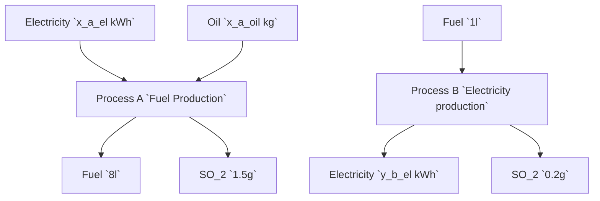

Please teach my how matrix **A** is aggregated from the information provided for question **a)**

---

Legg til grunn de to prosessene som er vist under. Prosess A bruker `x_a_oil` = 9 kg olje og `x_a_el` = 3 kWh elkraft for å produsere  8 liter drivstoff, med et utslipp på 1.5 g SO<sub>2</sub>. 
Prosess B krever 1 liter drivstoff for å levere `y_b_el` = 3 kWh elektrisk kraft, med et utslipp av 0.2 g SO<sub>2</sub>.


Systemet leverer samlet 1382 kWh elkraft til sluttforbruk (altså *final demand*).
****


**a)** (10 poeng) Definer teknologimatrisa (_technology matrix_) **A** for systemet, bruk følgende format:

```python
import numpy as np

A = np.array([['a_processA_fuel', 'a_processB_fuel'],
              ['a_processA_el', 'a_processB_el']])
```

der vi har satt _fuel_ = drivstoff, og _el_ = elkraft. Dere må altså plassere rett tall på riktig sted i matrisa

Definer svaret som en Python-variabel `A`. Det må være definert som en `np.array`.

---

For å definere teknologimatrisen **A** for systemet, må vi først forstå hvordan de ulike prosessene forholder seg til hverandre i henhold til forbruk og produksjon av ressursene: drivstoff og elektrisk kraft (elkraft).

Ut fra informasjonen gitt:

1. Prosess A:
    - Forbruker 9 kg olje og 3 kWh elkraft
    - Produserer 8 liter drivstoff
    - Vi ser ikke direkte på olje her siden matrisen vår fokuserer på drivstoff og elkraft.
    - Men vi vet at for hver kjøring av Prosess A, så produseres det 8 liter drivstoff.

2. Prosess B:
    - Forbruker 1 liter drivstoff
    - Produserer 3 kWh elektrisk kraft

I teknologimatrisen **A**, representerer kolonnene prosessene (A og B) og radene representerer produkter eller ressurser (i dette tilfellet drivstoff og elkraft). Elementene i matrisen angir forholdet mellom input (forbruk) og output for disse ressursene i hver prosess:

- `a_processA_fuel`: Dette er mengden drivstoff forbrukt per enhet av aktivitet i Prosess A. Siden Prosess A ikke forbruker drivstoff for å operere, er dette tallet 0.
- `a_processB_fuel`: Dette er mengden drivstoff forbrukt per enhet av aktivitet i Prosess B. Siden Prosess B forbruker 1 liter drivstoff for å produsere 3 kWh, er dette tallet -1 (vi bruker negativt for å indikere forbruk).
- `a_processA_el`: Dette er mengden elektrisk kraft forbrukt per enhet av aktivitet i Prosess A. Prosess A forbruker 3 kWh for å produsere 8 liter drivstoff, så dette er -3.
- `a_processB_el`: Dette er mengden elektrisk kraft produsert per enhet av aktivitet i Prosess B. Prosess B produserer 3 kWh per liter drivstoff, så dette er 3.

Med denne forståelsen, kan vi definere teknologimatrisen **A** i Python som følger:

```python
import numpy as np

A = np.array([[0, -1],  # Fuel consumption by processes A and B
              [-3, 3]])  # Electricity consumption/production by processes A and B
```

Her representerer første rad drivstoff og andre rad elektrisk kraft. Negative tall brukes for å representere forbruk, mens positive tall representerer produksjon.

---

Now for the next question:

---

**b)** (5 poeng) Definer sluttforbruksvektoren (_final demand vector_) 𝑓 for systemet, bruk følgende format:

```python
import numpy as np

f = np.array([['f_fuel'], ['f_el']])
```

Definer svaret som en Python-variabel `f`. Det må være definert som en `np.array`.

---

For å definere sluttforbruksvektoren \( \mathbf{f} \) for systemet, trenger vi å vite det endelige etterspørselsnivået for hver av ressursene: drivstoff og elektrisk kraft (elkraft).

Fra oppgaven vet vi:

- Systemet leverer totalt 1382 kWh elektrisk kraft til sluttforbruk.

Det er ikke gitt noe spesifikt sluttforbruk for drivstoff, så vi antar at all produksjon av drivstoff brukes internt i systemet for å generere elektrisk kraft, eller at det ikke er noen direkte etterspørsel etter drivstoff fra sluttbrukere. Derfor er sluttforbruket for drivstoff 0.

Dermed kan vi definere sluttforbruksvektoren \( \mathbf{f} \) i Python som følger:

```python
import numpy as np

f = np.array([[0],  # Final demand for fuel
              [1382]])  # Final demand for electricity
```

Her representerer første element sluttforbruket av drivstoff, og det andre elementet representerer sluttforbruket av elektrisk kraft.

---

**c)** (10 poeng) Definer intervensjonsmatrisa (_intervention matrix_) 𝐵 for systemet, bruk følgende format.

```python
import numpy as np

B = np.array([['𝐵𝑝𝑟𝑜𝑠𝑒𝑠𝑠𝐴,𝑜𝑖𝑙', '𝐵𝑝𝑟𝑜𝑠𝑒𝑠𝑠𝐵,𝑜𝑖𝑙'],
              ['𝐵𝑝𝑟𝑜𝑠𝑒𝑠𝑠𝐴,𝑆𝑂2', '𝐵𝑝𝑟𝑜𝑠𝑒𝑠𝑠𝐵,𝑆𝑂2']])

```

Bruk negative verdier for innstrømmer (_input av olje_, siden dette er uttak av naturressurser), og positive verdier for utslipp av SO2. Bruk enheter kg for uttak av råolje og gram for SO2-utslipp.

Definer svaret som en Python-variabel `B`. Det må være definert som en `np.array`.

**d)** (10 poeng) Regn ut hvor mye olje (_oil_, kg) og SO2-utslipp (gram) som behoves for å levere et **sluttforbruk på 1 liter drivstoff** (_final demand of 1 liter fuel_). Bruk følgende format:

```python
import numpy as np

B = np.array([['𝑟𝑜𝑖𝑙'],
              ['𝑟𝑆𝑂2']])

```

Definer svaret som en Python-variabel `r`. Ved matrisemultiplikasjon med arrays vil det av seg selv være et `np.array`.