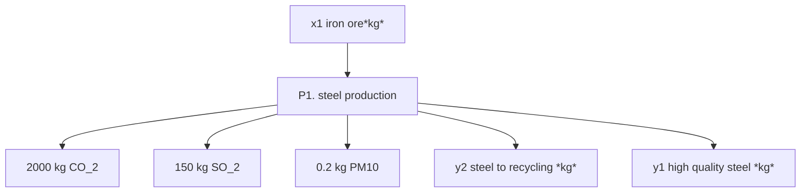

Could i solve this problems using `np.arrays` and `np.linalg.solve`?

---

Problem 2 (20 poeng): allokering for en prosess

En produsent av høykvalitetsstål begynner å sortere eget produksjonavfall som så sendes til gjenvinning (steel to recycling). De har dermed to produkter som de selger:

* sortert produksjonsavfall (steel to recycling)
* komponenter i høykvalitetsstål (high quality steel).

For å berege utslipp per kg produsert høykvalitetsstål må vi gjøre en allokering av innsatsmidler og utslipp mellom de to produktene.

Legg til grunn at produsjonen krever 𝑥1 = 2000 kg med jernmalm for å produsere 𝑦1 = 1300 kg høykvalitetsstål og 𝑦2 = 260 kg utsortert stål til gjenvinning.

Du er i tillegg gitt følgende informasjon om enhetsverdien av de to produktene:

* 𝑦1𝑒𝑐𝑜𝑛 = 1000 kr per kg høykvalitetsstål
* 𝑦2𝑒𝑐𝑜𝑛 = 100 kr per kg stål til gjenvinning.

**a)** (10 poeng) Regn ut **andelen** av utslippene som allokeres til høykvalitetsstål (high quality steel) med bruk av _masseallokering_ og _økonomisk allokering_.

Definer svaret som Python-variabler `x_mass_steel` og `x_econ_steel`.

---