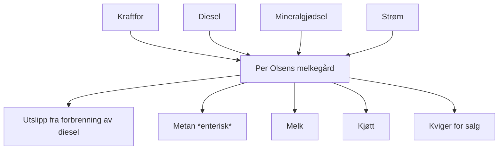

Problem 3 (40 poeng): Per Olsens bondegård

Et gårdsbruk er et eksempel på et produksjonssystem med mange produkter. I dette tilfellet har Per Olsen et melkebruk, det vil si gården produserer melk, melkekyr og storfe til slakt. Hvis man ønsker å sammenligne ett av disse produktene med et alternativ er man avhengig av å allokere innsatsmidler og utslipp mellom de tre produktene, for eksempel om man vil sammenligne klimautslippene fra storfe-kjøtt med utslipp fra svinekjøtt, eller utslippene per liter melk fra en typisk melkegård som Per Olsens gård med melk fra økologisk landbruk (som kanskje er et integrert bruk med også grønnsaksproduksjon) eller et større melkebruk der kjøttproduksjonen er av mindre betydning. For å sammenligne på tvers av disse må regne klimautslippene per enhet produkt og dermed allokere prosessinnsats og prosessutslipp mellom produktene.

Tallene er hentet fra en norsk LCA-studie fra 2013 der Bioforsk og NTNU vurderte arketyper for norske gårdsbruk. Tabellene under summerer noen av tallene for et midtnorsk melkebruk. Vi gjør mange forenklinger, blant annet har vi ikke med utslipp av N2O og metan fra kugjødsel og kunstgjødsel.

Her følger et forenklet flytskjema for Per Olsens gård. Gården drives som ett samlet system så det er ikke mulig å skille ut de enkelte delene av produksjonen. Melkeproduksjonen er avhengig av kjøttproduksjon, og motsatt, og hele gården er derfor å betrakte som én prosess som vi må dele i tre siden vi har tre produkter.

**Oppgavebeskrivelse**

Oppgaven går ut på å regne ut klimautslippene per liter melk. Vi skal bruke økonomisk allokering, altså dele utslippene basert på verdien av de ulike strømmene og deretter regne utslipp per enhet produkt. Matematikken for dette er beskrevet i Bakshi kap 10.1.2, som «partitioning» side 182-184.

Detaljert prosedyre finnes i [Oppgaveveiledningen](files/PerOlsen.pdf), kort fortalt skal vi:

* Definere allokeringskoeffisientene _w\_milk_, _w\_meat_, _w\_heif_ basert på den økonomiske verdien av de ulike strømmene og bruke denne i teknologimatrisa for å dele opp gården i tre prosesser (_heifer_ er kvige på engelsk).
* Sette opp teknologimatrise A for systemet med tre ulike produkter fra gården
* Definere intervensjonsmatrisa B og også her dele opp utslippene mellom de tre prosessene for gården
* Definere sluttforbruk (final demand, f), der dette er definert som 1 liter melk
* Beregne utslipp per liter melk, som _R = BA-1f_
* Til slutt sammenligne dette med å drikke noe annet, for eksempel fruktjuice fra Malta som har et utslipp på 0.4-1.2 kg CO2e per liter avhengig av hva det er laget av .

Følgende tabeller beskriver den årlige aktiviteten på Per Olsens bondegård. Disse tallene er også oppgitt i *Oppgaveveiledningen*.  

**Årlige utslipp og CO2-ekvivalenter**

| Utslipp | Årsak             | Mengde per år      | CO2-ekvivalenter per kg |
|:------- | :---------------- | :----------------- | :---------------------- |
| CO2     | Dieselforbrenning | $9980$ kg CO2     | 1 kg CO2e/kg                     | 
| CH4     | Enteriske utslipp  | $5270$ kg CH4  | $34$ kg CO2e/kg |

**Årlig forbruk av innsatsmidler, med CO2-ekvivalenter fra produksjon av hver enkelt**

| Input        | Inneholder    | Mengde per år | Produksjonsutslipp  |
| :----------- | :------------ | :------------ | :------------------ |
| Kraftfor     | Produksjon    | $60000$ kg     | $0.63$ kg CO2e/kg     | 
| Diesel       | Produksjon    | $3900$ liter| $0.25$ kg CO2e/liter|
| Kunstgjødsel | Produksjon    | $3195$ kg  | $1.88$ kg CO2e/kg  | 
| Strøm        | Produksjon    | $26000$ kWh   | $0.05$ kg CO2e/kWh   |

**Årlig produksjon fra Per Olsens gård. Kjøtt er både kviger og okser**

| Produkt           | Mengde per år | Enhetsverdi   | 
| :---------------- | :------------ | :------------ |
| Melk              | $133000$ liter    | $4$ kr/liter | 
| Kjøtt, slaktevekt | $5430$ kg       | $40$ kr/kg    | 
| Kviger for salg   | $1$ stk      | $11250$ kr/stk   | 

Når dere regner allokering ut fra massen for hvert produkt kan dere legge til grunn at en kvige har en slaktevekt på rundt 300 kg. 

**Riktig svar** utløses ved at dere regner ut klimautslippene per liter melk og oppgir denne som `CO2melk` i enhet [kg CO2e/liter] ut fra en økonomisk allokering.